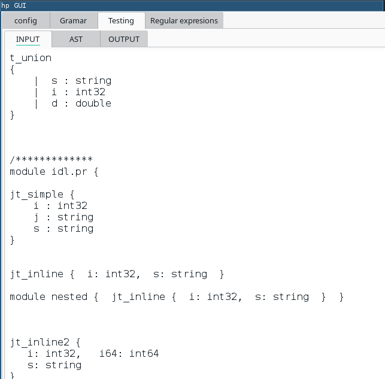

# Grammar and template editor

Part of [jle_cpp_tk/parser](https://github.com/jleahred/jle_cpp_tk/tree/master/src/core/hp)

This is a simple Qt program who helps us to write grammars, templates and debug it

You can work with several grammars and choose the proper one.

You can edit the grammar and templates

You can edit the input

You can edit show the tree with transformations applied

You can show the output

 
